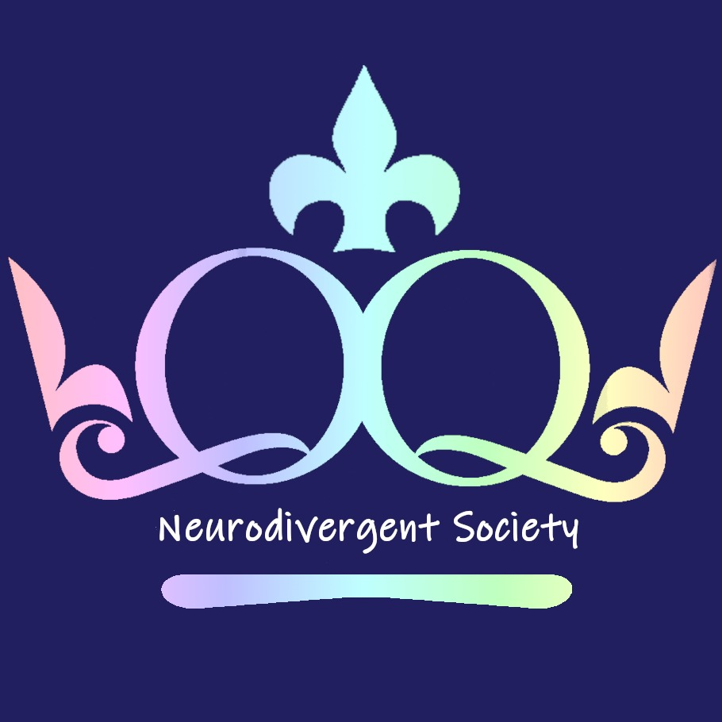

Welcome to the Neurodivergent Society! 

> *“One of the cruelest tricks our culture plays on autistic people is that it makes us strangers to ourselves. We grow up knowing we're different, but that difference is defined for us in terms of an absence of neurotypicality, not as the presence of another equally valid way of being.”*

>  *Julia Bascom*

