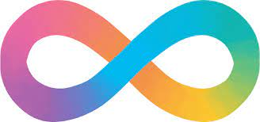

We encourage everyone to reach out either to find out more about the society or to show support. 
As part of our programme we try to find neurodivergent professionals to speak about their experiences. If you are interested in encouraging future neurodivergent representation and inspiring others, please get in touch. 

For further information or potential support, please email: lt21173@qmul.ac.uk

Or alternatively: victoriia.sereda@gmail.com

				
